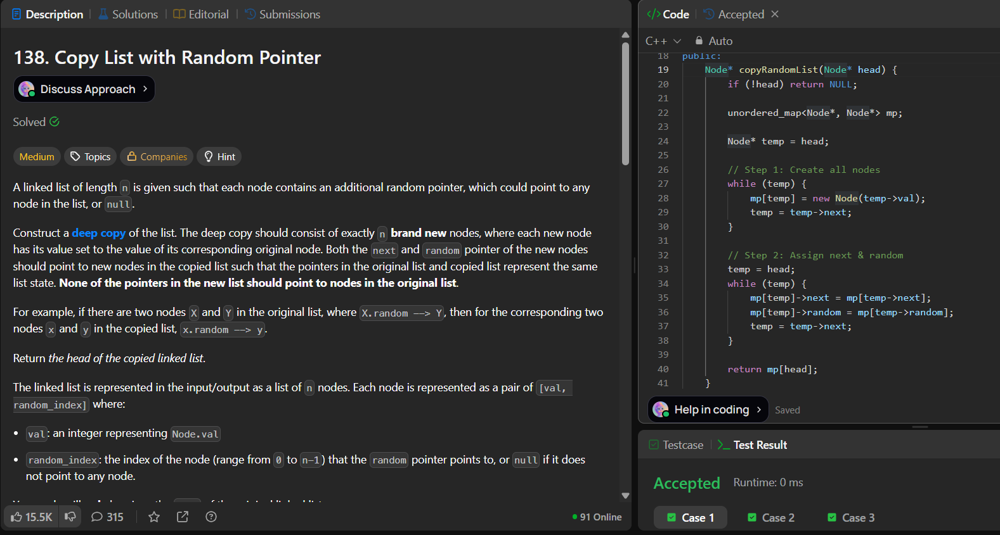

# LeetCode 138. **Copy List with Random Pointer**

## **Approach** - 
    - Use a hashmap to store mapping from each original node to its cloned node.
    - Firstly create all nodes and store them in the map.
    - Then, assign next and random pointers using the stored mappings.
   
## **Code** -
    
```cpp
/*
// Definition for a Node.
class Node {
public:
    int val;
    Node* next;
    Node* random;
    
    Node(int _val) {
        val = _val;
        next = NULL;
        random = NULL;
    }
};
*/

class Solution {
public:
    Node* copyRandomList(Node* head) {
        if (!head) return NULL;
        unordered_map<Node*, Node*> mp;
        Node* temp = head;

        // creating all nodes
        while (temp) {
            mp[temp] = new Node(temp->val);
            temp = temp->next;
        }

        // next & random ptrs
        temp = head;
        while (temp) {
            mp[temp]->next = mp[temp->next];
            mp[temp]->random = mp[temp->random];
            temp = temp->next;
        }

        return mp[head];
    }
};
```

 
