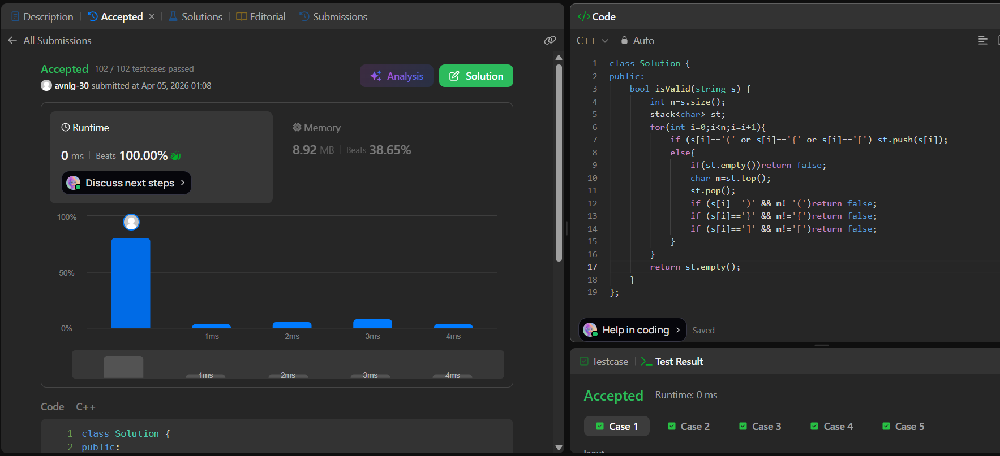

# LeetCode 20. **Valid Parentheses**

## **Approach** - 
    - Traverse the string and push every opening bracket (, {, [ onto the stack.
    - For every closing bracket, check if the stack is empty or if the top doesn’t match the corresponding opening bracket → return false.
    - At the end, the string is valid only if the stack is empty (all brackets matched).

## **Code** -
    
```cpp
class Solution {
public:
    bool isValid(string s) {
        int n=s.size();
        stack<char> st;
        for(int i=0;i<n;i=i+1){
            if (s[i]=='(' or s[i]=='{' or s[i]=='[') st.push(s[i]);
            else{
                if(st.empty())return false;
                char m=st.top();
                st.pop();
                if (s[i]==')' && m!='(')return false;
                if (s[i]=='}' && m!='{')return false;
                if (s[i]==']' && m!='[')return false;
            }
        }
        return st.empty();
    }
};
```


