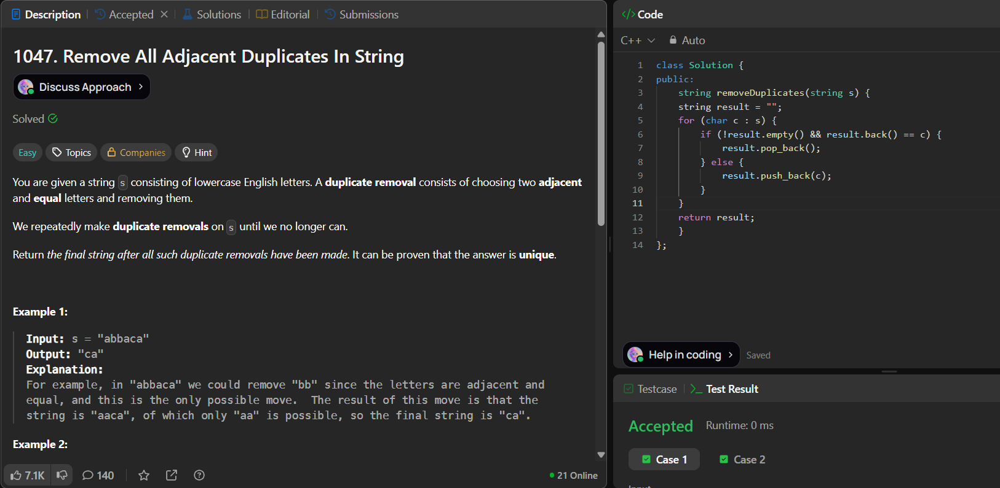

# LeetCode 1047. **Remove All Adjacent Duplicates In String**


## **Approach** - 
    - Treat the result string as a stack. 
    - Traverse the input, and if current character == last character in result, remove it (pop); otherwise, add it (push).
    - This ensures adjacent duplicates cancel out in one pass (O(n)).

## **Code** -
    
```cpp
class Solution {
public:
    string removeDuplicates(string s) {
    string result = "";
    for (char c : s) {
        if (!result.empty() && result.back() == c) {
            result.pop_back();
        } else {
            result.push_back(c);
        }
    }
    return result;
    }
};
```


