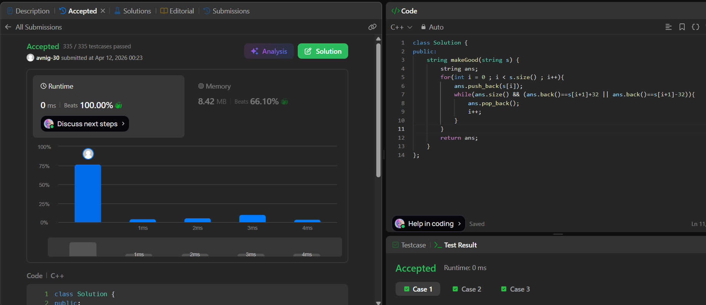

# LeetCode 1544. **Make The String Great**

## **Approach** - 
    - Use a stack-like approach with a string :
        * Traverse the string and keep adding characters to `ans`.
        * If the current character and the last character in `ans` differ only by case (ASCII difference 32), remove the last character (cancel the pair).
        * Continue this process so that only “good” adjacent pairs remain removed, giving the final string.


## **Code** -
    
```cpp
class Solution {
public:
    string makeGood(string s) {
        string ans;
        for(int i = 0 ; i < s.size() ; i++){
            ans.push_back(s[i]);
            while(ans.size() && (ans.back()==s[i+1]+32 || ans.back()==s[i+1]-32)){
                ans.pop_back();
                i++;
            }
        }
        return ans;
    }
};
```


