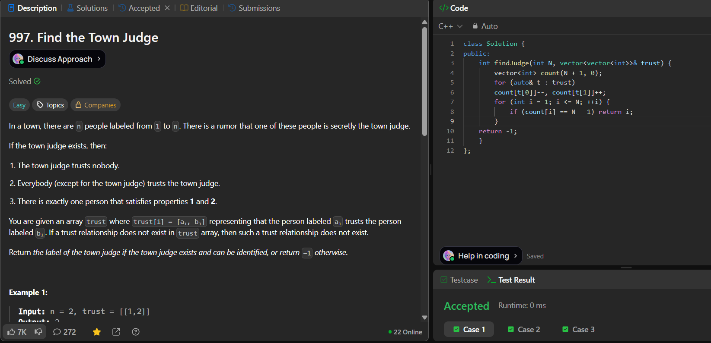

# LeetCode 997. **Find The Town Judge**

## **Approach** - 
    - Maintain a `count` array where trusting someone decreases your score and being trusted increases it.
    - The town judge will have `count[i] = N - 1` (trusted by everyone else and trusts nobody).
    - Traverse the array and return the index with value `N-1`, else return `-1`.


## **Code** -
    
```cpp
class Solution {
public:
    int findJudge(int N, vector<vector<int>>& trust) {
        vector<int> count(N + 1, 0);
        for (auto& t : trust)
        count[t[0]]--, count[t[1]]++;
        for (int i = 1; i <= N; ++i) {
            if (count[i] == N - 1) return i;
        }
    return -1;
    }
};
```


