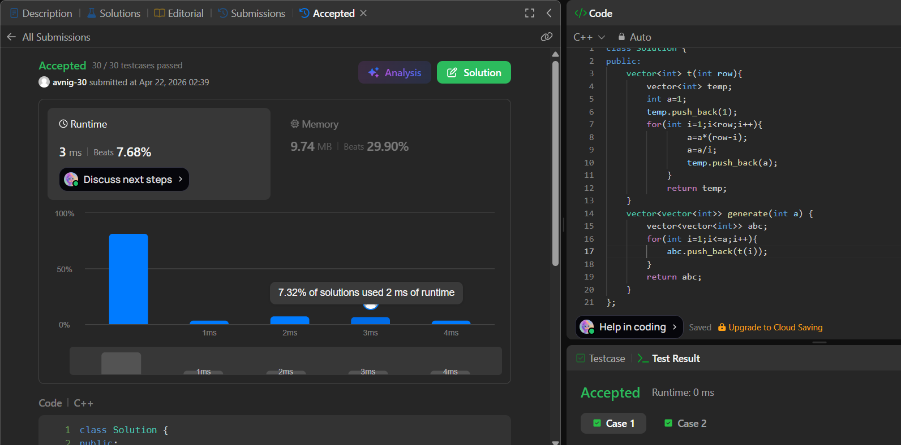

# LeetCode 118. **Pascal's Triangle**

## **Approach** - 
    - Each row is built using the nCr relation where every element is computed iteratively from the previous one using multiplication and division to avoid factorials. 
    - The t(i) function builds the i-th row, and generate(a) collects all rows up to a.


## **Code** -
    
```cpp
class Solution {
public:
    vector<int> t(int row){
        vector<int> temp;
        int a=1;
        temp.push_back(1);
        for(int i=1;i<row;i++){
                a=a*(row-i);
                a=a/i;
                temp.push_back(a);
            }
            return temp;
    }
    vector<vector<int>> generate(int a) {
        vector<vector<int>> abc;
        for(int i=1;i<=a;i++){
            abc.push_back(t(i));
        }
        return abc;
    }
};
```
     

