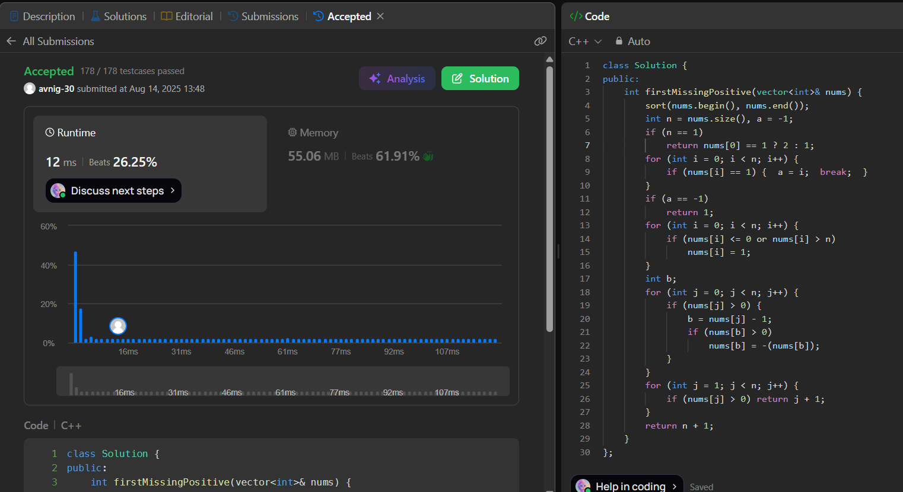

# LeetCode 41. **First Missing Positive**

## **Approach** - 
    - Treat index i as number i+1 and mark presence by making that index negative.
    - The first index that remains positive means its number is missing.
    - If all are marked, answer is n+1.

## **Code** -
    
```cpp
class Solution {
public:
    int firstMissingPositive(vector<int>& nums) {
        sort(nums.begin(), nums.end());
        int n = nums.size(), a = -1;
        if (n == 1)
            return nums[0] == 1 ? 2 : 1;
        for (int i = 0; i < n; i++) {
            if (nums[i] == 1) {  a = i;  break;  }
        }
        if (a == -1)
            return 1;
        for (int i = 0; i < n; i++) {
            if (nums[i] <= 0 or nums[i] > n)
                nums[i] = 1;
        }
        int b;
        for (int j = 0; j < n; j++) {
            if (nums[j] > 0) {
                b = nums[j] - 1;
                if (nums[b] > 0)
                    nums[b] = -(nums[b]);
            }
        }
        for (int j = 1; j < n; j++) {
            if (nums[j] > 0) return j + 1;
        }
        return n + 1;
    }
};
```


