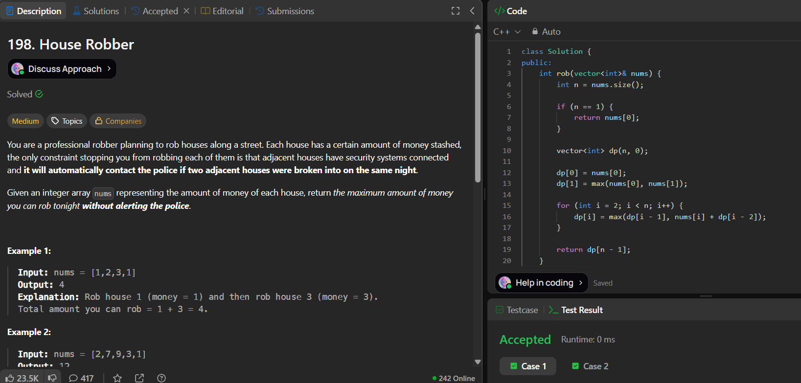

# LeetCode 198. **House Robber**

## **Approach** - 
    - At each house, decide: rob it (nums[i] + dp[i-2]) or skip it (dp[i-1]).
    - Build a DP array where dp[i] stores the maximum money up to house i.
    - Final answer is dp[n-1], representing the optimal choice over all houses


## **Code** -
    
```cpp
class Solution {
public:
    int rob(vector<int>& nums) {
        int n = nums.size();

        if (n == 1) {
            return nums[0];
        }

        vector<int> dp(n, 0);

        dp[0] = nums[0];
        dp[1] = max(nums[0], nums[1]);

        for (int i = 2; i < n; i++) {
            dp[i] = max(dp[i - 1], nums[i] + dp[i - 2]);
        }

        return dp[n - 1];        
    }
};
```
     

