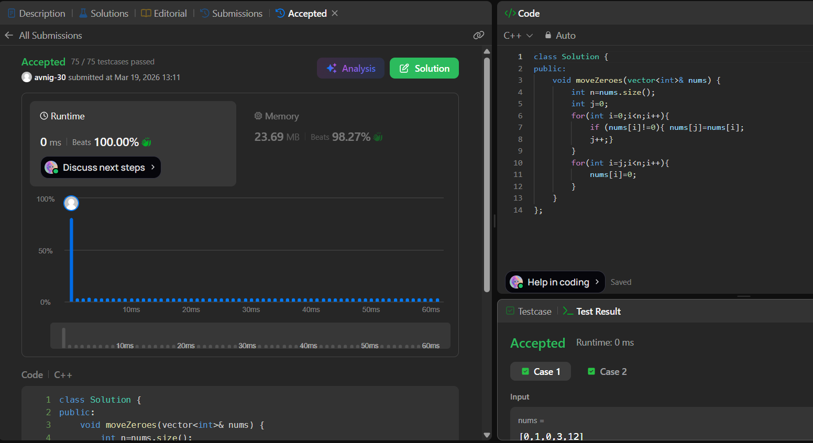

# LeetCode 283. **Move Zeroes**

## **Approach** - 
    - Traverse the array and shift all non-zero elements forward using a pointer j.
    - After non-zero elements, fill the remaining positions from j to end with zeros.

## **Code** -
    
```cpp
class Solution {
public:
    void moveZeroes(vector<int>& nums) {
        int n=nums.size();
        int j=0;
        for(int i=0;i<n;i++){
            if (nums[i]!=0){ nums[j]=nums[i];
            j++;}
        }
        for(int i=j;i<n;i++){
            nums[i]=0;
        }
    }
};
```

 
