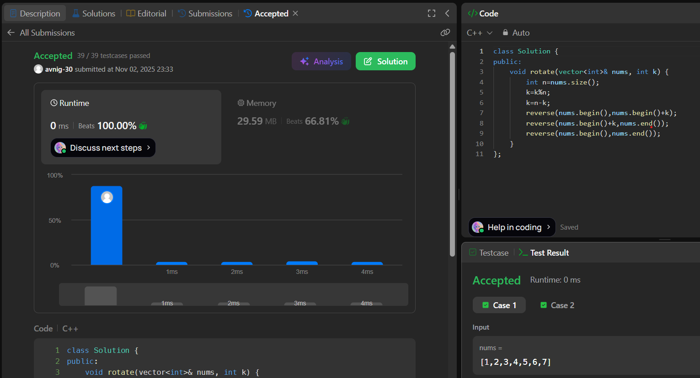

# LeetCode 189. **Rotate Array**

## **Approach** - 
    - Convert right rotation by k into left rotation by n-k.
    - First reverse first n-k elements, then reverse remaining k elements, and finally reverse the whole array.
    - This results in the array rotated right by k in O(n) time and O(1) space.
   
## **Code** -
    
```cpp
class Solution {
public:
    void rotate(vector<int>& nums, int k) {
        int n=nums.size();
        k=k%n;
        k=n-k;
        reverse(nums.begin(),nums.begin()+k);
        reverse(nums.begin()+k,nums.end());
        reverse(nums.begin(),nums.end());
    }
};
```

 
