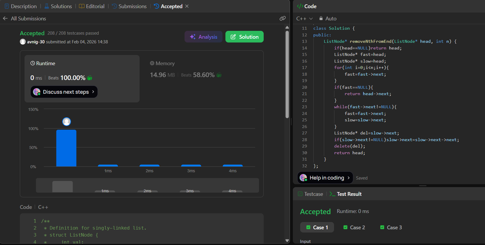

# LeetCode 19. **Remove Nth Node From End of List**

## **Approach** -
    - Use two pointers (fast & slow): move fast ahead by n nodes first.
    - Then move both together until fast reaches the end, so slow is just before the node to delete.
    - Handle edge case when fast == NULL (remove head), otherwise unlink slow->next. 
    
   
## **Code** -
    
```cpp
/**
 * Definition for singly-linked list.
 * struct ListNode {
 *     int val;
 *     ListNode *next;
 *     ListNode() : val(0), next(nullptr) {}
 *     ListNode(int x) : val(x), next(nullptr) {}
 *     ListNode(int x, ListNode *next) : val(x), next(next) {}
 * };
 */
class Solution {
public:
    ListNode* removeNthFromEnd(ListNode* head, int n) {
        if(head==NULL)return head;
        ListNode* fast=head;
        ListNode* slow=head;
        for(int i=0;i<n;i++){
            fast=fast->next;
        }
        if(fast==NULL){
            return head->next;
        }
        while(fast->next!=NULL){
            fast=fast->next;
            slow=slow->next;
        }
        ListNode* del=slow->next;
        if(slow->next!=NULL)slow->next=slow->next->next;
        delete(del);
        return head;
    }
};
```

 
