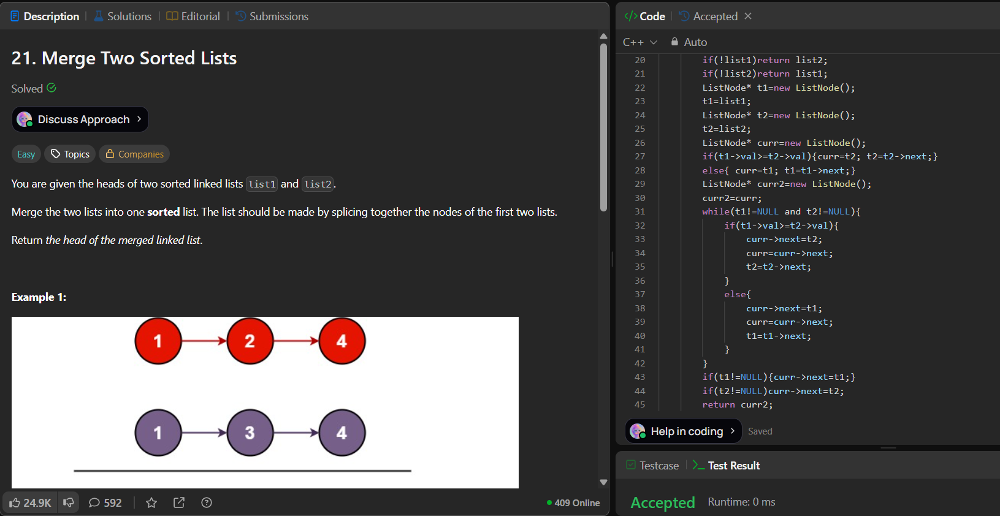

# LeetCode 21. **Merge Two Sorted Lists**

## **Approach** -
    - Use two pointers (t1, t2) to traverse both sorted lists and compare their values. 
    - Pick the smaller node each time and attach it to the result list, moving the corresponding pointer forward. 
    - Continue until one list ends, then append the remaining nodes of the other list.
    
   
## **Code** -
    
```cpp
/**
 * Definition for singly-linked list.
 * struct ListNode {
 *     int val;
 *     ListNode *next;
 *     ListNode() : val(0), next(nullptr) {}
 *     ListNode(int x) : val(x), next(nullptr) {}
 *     ListNode(int x, ListNode *next) : val(x), next(next) {}
 * };
 */
class Solution {
public:
    ListNode* mergeTwoLists(ListNode* list1, ListNode* list2) {
        /*
        1st list-return ans (keep its head)
        2 pointers to traverse
        1 ptr to track curr
        if any list empty return the other one
        */
        if(!list1)return list2;
        if(!list2)return list1;
        ListNode* t1=new ListNode();
        t1=list1;
        ListNode* t2=new ListNode();
        t2=list2;
        ListNode* curr=new ListNode();
        if(t1->val>=t2->val){curr=t2; t2=t2->next;}
        else{ curr=t1; t1=t1->next;}
        ListNode* curr2=new ListNode();
        curr2=curr;
        while(t1!=NULL and t2!=NULL){
            if(t1->val>=t2->val){
                curr->next=t2;
                curr=curr->next;
                t2=t2->next;
            }
            else{
                curr->next=t1;
                curr=curr->next;
                t1=t1->next;
            }
        }
        if(t1!=NULL){curr->next=t1;}
        if(t2!=NULL)curr->next=t2;
        return curr2;
    }
};
```

 