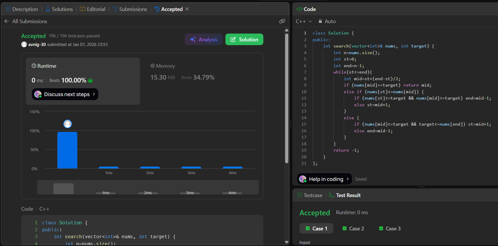

# LeetCode 33. **Search in Rotated Sorted Array**

## **Approach** - 
    - Modified binary search on a rotated sorted array.
    - At each step, check whether the left half is sorted or the right half is sorted, then decide if the target lies in that sorted portion.
    - Accordingly, eliminate half of the search space → O(log n) time.
   
## **Code** -
    
```cpp
class Solution {
public:
    int search(vector<int>& nums, int target) {
        int n=nums.size();
        int st=0;
        int end=n-1;
        while(st<=end){
            int mid=st+(end-st)/2;
            if (nums[mid]==target) return mid;
            else if (nums[st]<=nums[mid]) {
                if (nums[st]<=target && nums[mid]>=target) end=mid-1;
                else st=mid+1;
            } 
            else {
                if (nums[mid]<=target && target<=nums[end]) st=mid+1;
                else end=mid-1;
            }
        }
        return -1;
    }
};
```

 