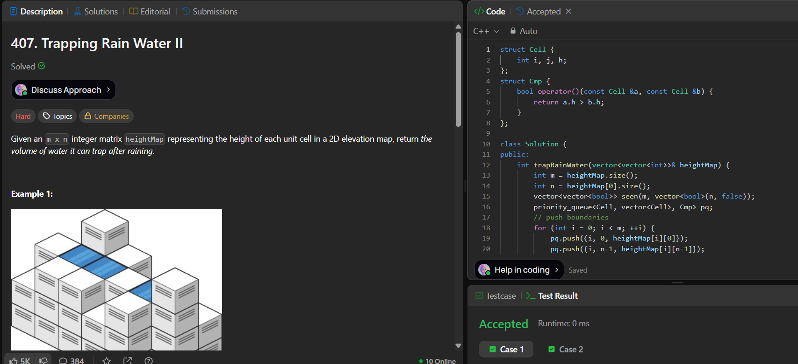

# LeetCode 407. **Trapping Rain Water II**

## **Approach** - 
    - Use a min-heap (priority queue) to always process the lowest boundary cell first, starting from all outer boundary cells.
    - Expand inward using BFS; for each neighbor, trap water if its height is lower than the current boundary, and push it with updated height (max(current height, neighbor height)).
    - This simulates filling water level from outside to inside, ensuring correct accumulation.

## **Code** -
    
```cpp
struct Cell {
    int i, j, h;
};
struct Cmp {
    bool operator()(const Cell &a, const Cell &b) {
        return a.h > b.h;
    }
};

class Solution {
public:
    int trapRainWater(vector<vector<int>>& heightMap) {
        int m = heightMap.size();
        int n = heightMap[0].size();
        vector<vector<bool>> seen(m, vector<bool>(n, false));
        priority_queue<Cell, vector<Cell>, Cmp> pq;
        // push boundaries
        for (int i = 0; i < m; ++i) {
            pq.push({i, 0, heightMap[i][0]});
            pq.push({i, n-1, heightMap[i][n-1]});
            seen[i][0] = seen[i][n-1] = true;
        }
        for (int j = 1; j < n-1; ++j) {
            pq.push({0, j, heightMap[0][j]});
            pq.push({m-1, j, heightMap[m-1][j]});
            seen[0][j] = seen[m-1][j] = true;
        }
        int res = 0;
        int dirs[4][2] = {{0,1},{1,0},{0,-1},{-1,0}};
        while (!pq.empty()) {
            Cell c = pq.top(); pq.pop();
            for (auto &d : dirs) {
                int ni = c.i + d[0], nj = c.j + d[1];
                if (ni < 0 || ni >= m || nj < 0 || nj >= n) continue;
                if (seen[ni][nj]) continue;
                seen[ni][nj] = true;
                int nh = heightMap[ni][nj];
                if (nh < c.h) {
                    res += (c.h - nh);
                    // we fill water, new barrier height remains c.h
                    pq.push({ni, nj, c.h});
                } else {
                    pq.push({ni, nj, nh});
                }
            }
        }
        return res;
    }
};
```

