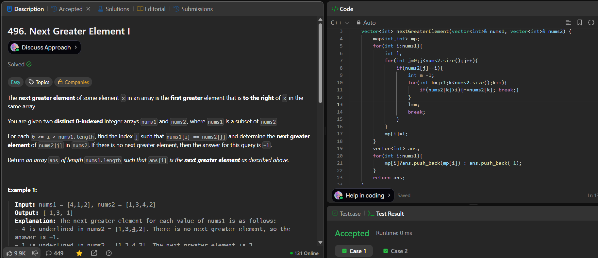

# LeetCode 496. **Next Greater Element I**

## **Approach** - 
    - For each element in nums1,find its position in nums2, then get the next greater element in right.
    - You store results in a map and build the ans array using that map.
    - Overall time complexity is O(n₁ × n₂) due to nested loops.

## **Code** -
    
```cpp
class Solution {
public:
    vector<int> nextGreaterElement(vector<int>& nums1, vector<int>& nums2) {
        map<int,int> mp;
        for(int i:nums1){
            int l;
            for(int j=0;j<nums2.size();j++){
                if(nums2[j]==i){
                    int m=-1;
                    for(int k=j+1;k<nums2.size();k++){
                        if(nums2[k]>i){m=nums2[k]; break;}
                    }
                    l=m;
                    break;
                }
            }
            mp[i]=l;
        }
        vector<int> ans;
        for(int i:nums1){
            mp[i]?ans.push_back(mp[i]) : ans.push_back(-1);
        }
        return ans;
    }
};
```

