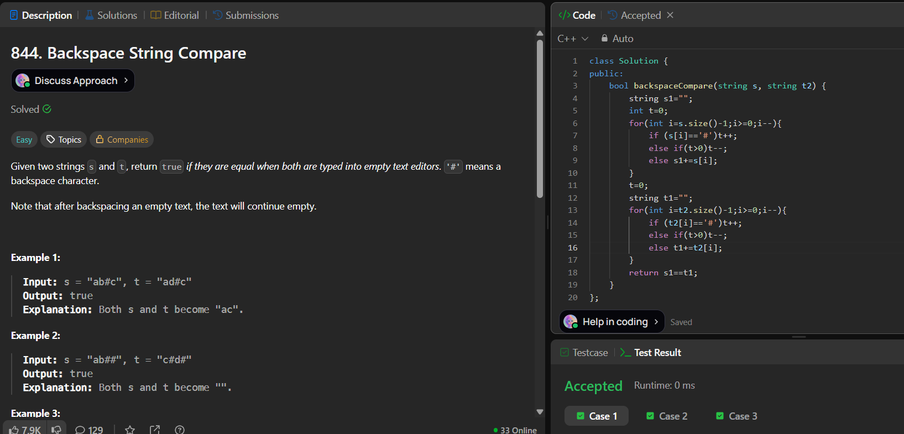

# LeetCode 844. **Backspace String Compare**

## **Approach** - 
    - Traverse both strings from right to left, using a counter to simulate backspaces (#).
    - Skip characters when the counter is positive, otherwise add valid characters to a result string.
    - Finally, compare the processed versions of both strings to check equality.

## **Code** -
    
```cpp
class Solution {
public:
    bool backspaceCompare(string s, string t2) {
        string s1="";
        int t=0;
        for(int i=s.size()-1;i>=0;i--){
            if (s[i]=='#')t++;
            else if(t>0)t--;
            else s1+=s[i];
        }
        t=0;
        string t1="";
        for(int i=t2.size()-1;i>=0;i--){
            if (t2[i]=='#')t++;
            else if(t>0)t--;
            else t1+=t2[i];
        }
        return s1==t1;
    }
};
```

