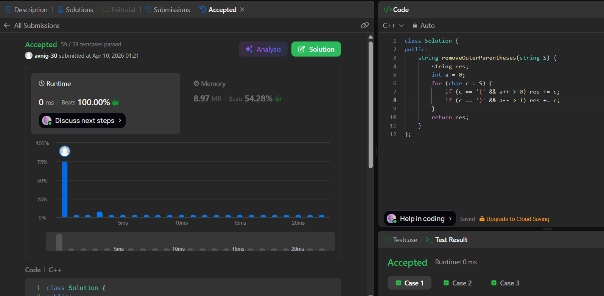

# LeetCode 1021. **Remove Outermost Parentheses**

## **Approach** - 
    - Increment a for '(' and decrement for ')'.
    - Only append '(' if it’s not the outermost (a > 0) and ')' if it’s not closing the outermost (a > 1).

## **Code** -
    
```cpp
class Solution {
public:
    string removeOuterParentheses(string S) {
        string res;
        int a = 0;
        for (char c : S) {
            if (c == '(' && a++ > 0) res += c;
            if (c == ')' && a-- > 1) res += c;
        }
        return res;
    }
};
```

