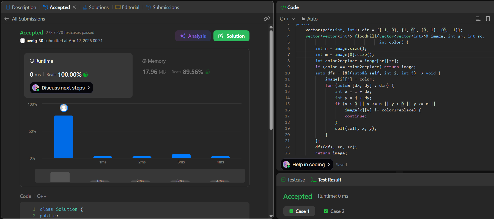

# LeetCode 1021. **Flood Fill**

## **Approach** - 
    - Use DFS traversal starting from `(sr, sc)` and store the original color to replace.
    - Recursively visit all 4-directionally connected cells having the same original color and update them to the new color.
    - Skip out-of-bound cells or those with different color, ensuring only the connected component is modified.


## **Code** -
    
```cpp
class Solution {
public:
    vector<pair<int, int>> dir = {{-1, 0}, {1, 0}, {0, 1}, {0, -1}};
    vector<vector<int>> floodFill(vector<vector<int>>& image, int sr, int sc,
                                  int color) {
        int n = image.size();
        int m = image[0].size();
        int color2replace = image[sr][sc];
        if (color == color2replace) return image;
        auto dfs = [&](auto&& self, int i, int j) -> void {
            image[i][j] = color;
            for (auto& [dx, dy] : dir) {
                int x = i + dx;
                int y = j + dy;
                if (x < 0 || x >= n || y < 0 || y >= m ||
                    image[x][y] != color2replace) {
                    continue;
                }
                self(self, x, y);
            }
        };
        dfs(dfs, sr, sc);
        return image;
    }
};
```

