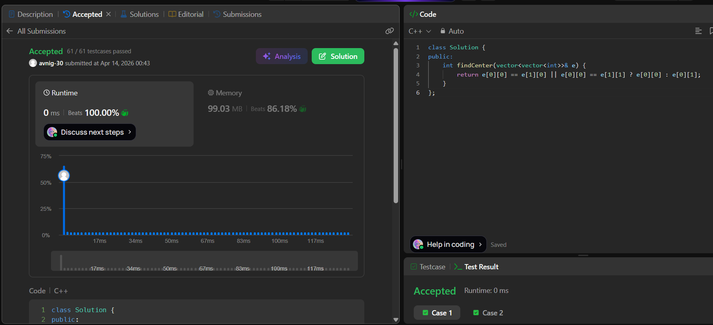

# LeetCode 1791. **Find Center of Star Graph**

## **Approach** - 
    - Treat the graph as a star: the center node must appear in both of the first two edges
    - Compare `e[0][0]` with `e[1][0]` and `e[1][1]`; if it matches, that’s the center, otherwise `e[0][1]` is the center.


## **Code** -
    
```cpp
class Solution {
public:
    int findCenter(vector<vector<int>>& e) {
        return e[0][0] == e[1][0] || e[0][0] == e[1][1] ? e[0][0] : e[0][1];
    }
};
```

