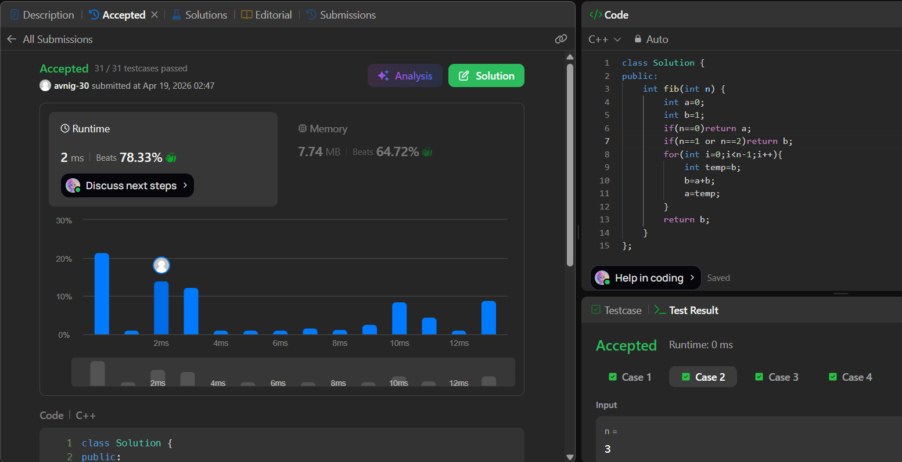

# LeetCode 509. **Fibonacci Number**

## **Approach** - 
    - Iterative DP (space-optimized): start with base cases a = 0, b = 1, then iteratively update them so each step computes the next Fibonacci number as a + b.
    - Shift the pair forward (a = b, b = a + b) until reaching n.
    - Runs in O(n) time and O(1) space.


## **Code** -
    
```cpp
class Solution {
public:
    int fib(int n) {
        int a=0;
        int b=1;
        if(n==0)return a;
        if(n==1 or n==2)return b;
        for(int i=0;i<n-1;i++){
            int temp=b;
            b=a+b;
            a=temp;
        }
        return b;
    }
};
```
     
