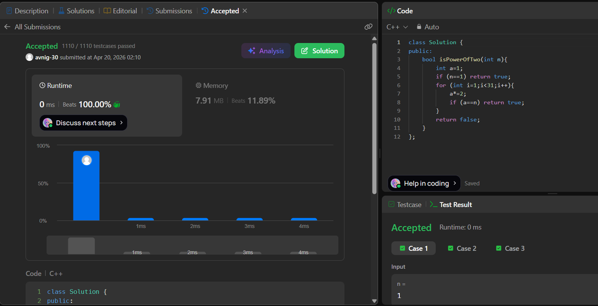

# LeetCode 231. **Power of Two**

## **Approach** - 
    - Start with 1 and keep multiplying by 2 in a loop to generate powers of two.
    - At each step, compare with n; if it matches, return true.
    - If no match is found within 31 iterations (int range), return false.


## **Code** -
    
```cpp
class Solution {
public:
    bool isPowerOfTwo(int n){
        int a=1;
        if (n==1) return true;
        for (int i=1;i<31;i++){
            a*=2;
            if (a==n) return true;
        }
        return false;
    }
};
```
     
