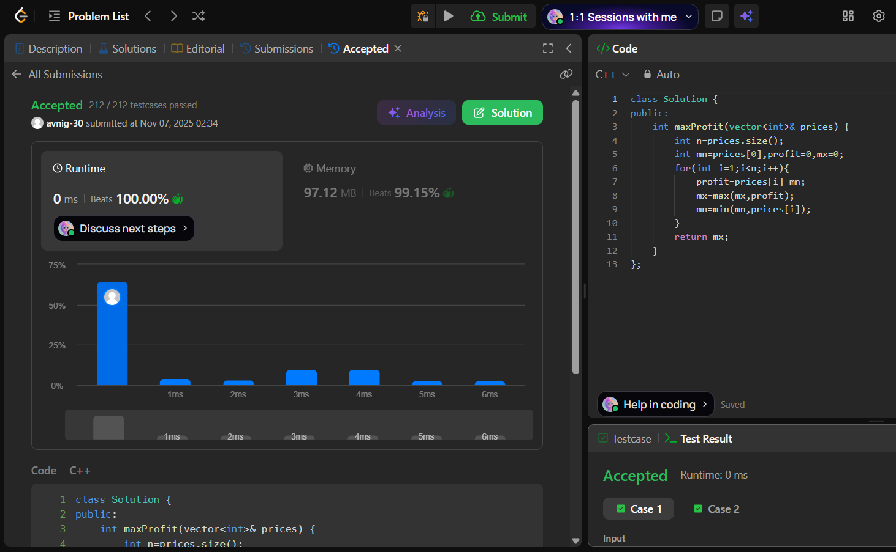

# LeetCode 121. **Best Time to Buy and Sell Stock**

## **Approach** - 
    - Traverse prices while tracking the minimum price seen so far (best day to buy).
    - For each day, profit = current price − minimum price and update the maximum profit.
    - Update the minimum price if a lower price appears.

## **Code** -
    
```cpp
class Solution {
public:
    int maxProfit(vector<int>& prices) {
        int n=prices.size();
        int mn=prices[0],profit=0,mx=0;
        for(int i=1;i<n;i++){
            profit=prices[i]-mn;
            mx=max(mx,profit);
            mn=min(mn,prices[i]);
        }
        return mx;
    }
};
```

