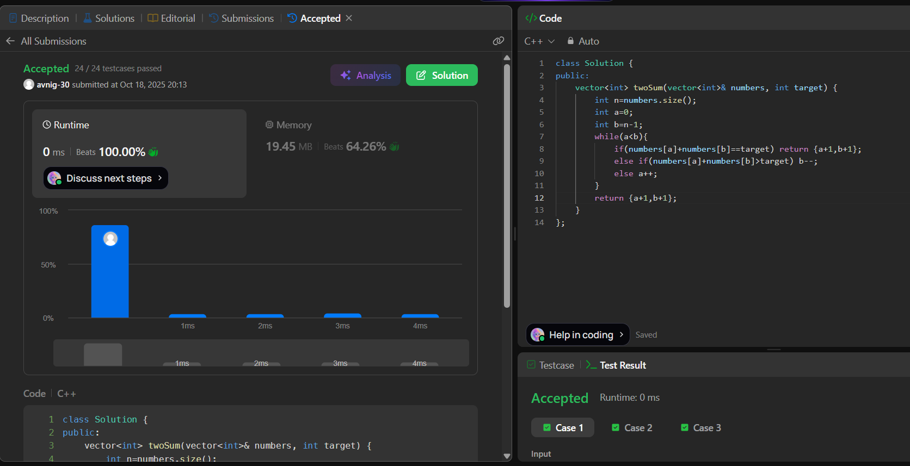

# LeetCode 167. **Two Sum II - Input Array Is Sorted**

## **Approach** - 
    - Use two pointers: one at the start and one at the end of the sorted array.
    - If sum equals target, return their 1-based indices.
    - If sum is too big move right pointer left, else move left pointer right.
      (This works because the array is already sorted.)

## **Code** -
    
```cpp
class Solution {
public:
    vector<int> twoSum(vector<int>& numbers, int target) {
        int n=numbers.size();
        int a=0;
        int b=n-1;
        while(a<b){
            if(numbers[a]+numbers[b]==target) return {a+1,b+1};
            else if(numbers[a]+numbers[b]>target) b--;
            else a++;
        }
        return {a+1,b+1};
    }
};
```

