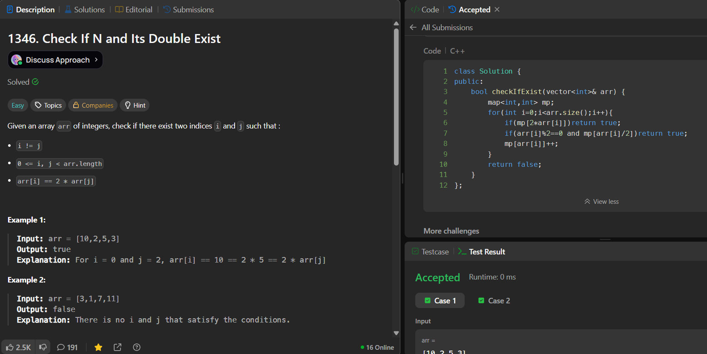

# LeetCode 1346. **Check If N and Its Double Exist**

## **Approach** - 
    - Traverse the array while storing seen elements in a map. 
    - For each element x, check if 2*x or (if x is even) x/2 already exists in the map. 
    - If yes, a valid pair exists; otherwise, insert x into the map and continue.

## **Code** -
    
```cpp
class Solution {
public:
    bool checkIfExist(vector<int>& arr) {
        map<int,int> mp;
        for(int i=0;i<arr.size();i++){
            if(mp[2*arr[i]])return true;
            if(arr[i]%2==0 and mp[arr[i]/2])return true;
            mp[arr[i]]++;
        }
        return false;
    }
};
```

 