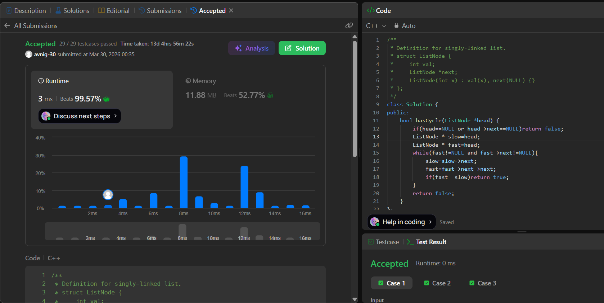

# LeetCode 141. **Linked List Cycle**

## **Approach** -
    - Use two pointers (slow & fast); slow moves 1 step, fast moves 2 steps.
    - If a cycle exists, they will eventually meet inside the loop.
    - If fast reaches NULL, no cycle is present.
    
   
## **Code** -
    
```cpp
/**
 * Definition for singly-linked list.
 * struct ListNode {
 *     int val;
 *     ListNode *next;
 *     ListNode(int x) : val(x), next(NULL) {}
 * };
 */
class Solution {
public:
    bool hasCycle(ListNode *head) {
        if(head==NULL or head->next==NULL)return false;
        ListNode * slow=head;
        ListNode * fast=head;
        while(fast!=NULL and fast->next!=NULL){
            slow=slow->next;
            fast=fast->next->next;
            if(fast==slow)return true;
        }
        return false;
    }
};
```

 